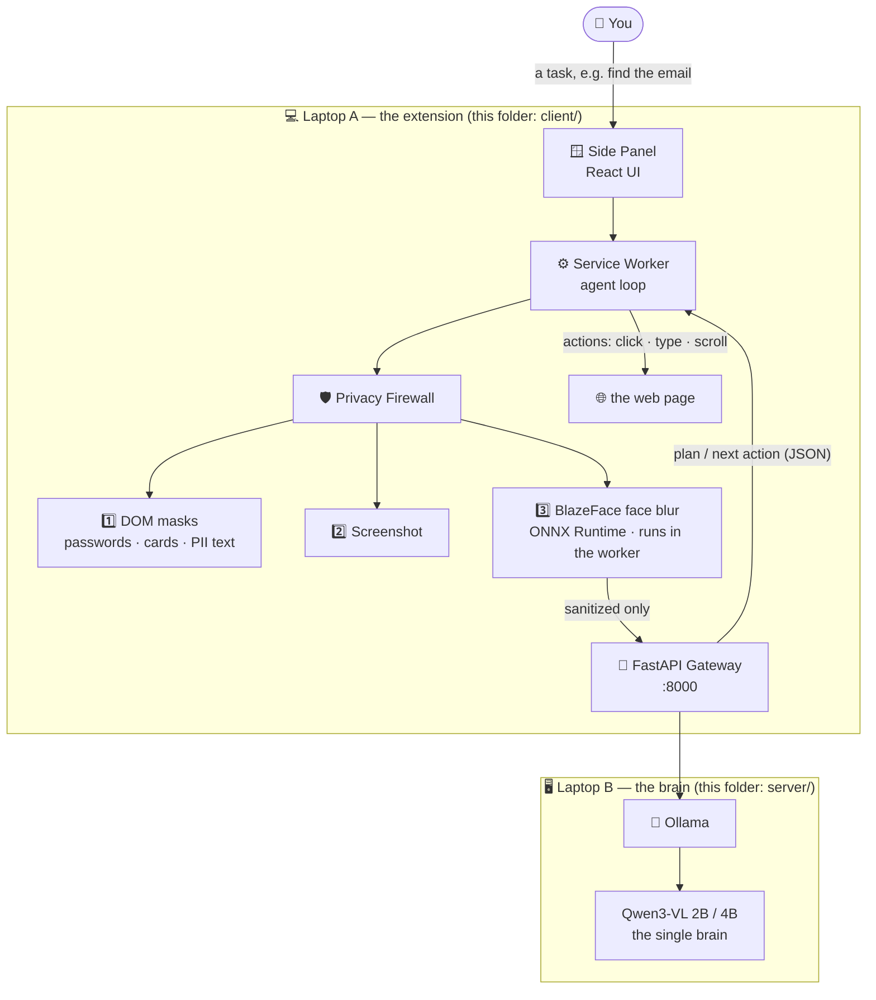

<div align="center">

# 🛡️ Aegis-Agent

### *Browse with a privacy firewall.*

**A browser assistant that never lets your sensitive data leave your computer** — faces are blurred, passwords and personal info are blacked out *before* anything is sent to the AI, and the AI (Qwen3-VL) runs on your own server.


</div>

---

> 💬 *"Find the contact email on this page."*
>
> The agent looks at the page — but every face is already blurred, every password field and email is already a black box. The AI only ever sees the sanitized version, plans the next click, and your browser performs it locally. **Your pixels never leave your device unredacted.**

Built for **Smart India Hackathon 2026 — Problem Statement 26171** *(On-device Visual Perception for Light-weight Browser Agents, ISRO / Smart Automation)*.

---

## 🧠 How it works



**The flow, in plain words:**

1. You type a task in the side panel.
2. Before *anything* is sent anywhere, the privacy firewall runs **on your laptop**: it covers password/payment fields and personal info (emails, phone numbers) with black boxes in the page, takes the screenshot, then **blurs every detected face** with an on-device AI model (BlazeFace).
3. Only the sanitized screenshot + a stripped-down text map of the page go to your FastAPI server over the LAN.
4. **Qwen3-VL** (the only AI model in the system) looks at the sanitized page and replies with the next action — "click element 12", "scroll down", "done".
5. Your browser performs the action locally, re-observes the page (sanitized again), and the loop continues until the task is done.

If the face model can't load, visual tasks **refuse to run** rather than sending an unredacted screenshot — privacy fails closed, never open.

## ✨ Highlights

| | Feature | What it means |
|---|---|---|
| 🛡️ | **Privacy firewall before every request** | DOM-level masks (passwords, cards, emails, phones) + on-device face detection with 18px blur — applied to *every* screenshot, not just the preview |
| 🧠 | **One brain** | Qwen3-VL is the only planning/reasoning model. Planner / Navigator / Validator are prompt roles of that one model — no model zoo, no confusion |
| 🔒 | **Fail-closed egress** | Missing face model? Visual data is refused, never sent raw. Text is scrubbed (`[REDACTED_EMAIL]`, `[REDACTED_PHONE]`, `[REDACTED_PAYMENT]`) |
| ⚡ | **Inference inside the service worker** | ONNX Runtime Web runs BlazeFace directly in the Chrome MV3 service worker (WASM backend) — no extra processes, no server round-trip for privacy |
| 🔁 | **Model test matrix** | Qwen3-VL 2B/4B (local, primary) plus qwen3.5 2B/4B and Ollama-cloud models for A/B testing — switch with one env var |
| 🖥️ | **Two-laptop demo** | Everything sensitive stays on Laptop A; the heavy model runs on Laptop B over LAN/Ethernet/hotspot |
| 🎨 | **Two-mood UI** | Terminal-dark theme with a WebGL FaultyTerminal hero, or a paper/sticker light theme — same panel, two personalities |

## 📁 Project structure

```
Aegis-Agent/
│
├── 🖥️ client/                    # the Chrome extension (Laptop A)
│   ├── chrome-extension/         #   MV3 service worker — agents + privacy firewall
│   │   └── src/background/
│   │       ├── agent/            #     Planner · Navigator · Validator (one model, three roles)
│   │       ├── browser/          #     puppeteer/CDP action execution
│   │       └── sih/              #     🛡️ privacy: DOM masks, BlazeFace, sanitizer, gateway client
│   ├── pages/
│   │   ├── side-panel/           #   the chat UI (React + Tailwind)
│   │   └── options/              #   settings UI
│   └── packages/                 #   shared storage, UI, i18n (pnpm monorepo)
│
└── ⚙️ server/                     # the brain (Laptop B)
    ├── backend/
    │   ├── app.py                #   FastAPI gateway — OpenAI-compatible API over Ollama
    │   ├── smoke_test.py         #   health/models/chat checks
    │   └── requirements.txt
    ├── client_context.md         #   📜 the full client↔server contract (read this!)
    └── project_context.md        #   📜 problem statement, architecture, decisions
```

## 🚀 Quick start

You need **two machines on the same network** (or run both on one machine for testing — then use `127.0.0.1` everywhere).

### Prerequisites

- **Laptop A (client):** Node 18+, pnpm, Google Chrome
- **Laptop B (server):** Python 3.11+, [Ollama](https://ollama.com)

### 1 · Server (Laptop B) — the brain

```bash
git clone https://github.com/lukan-lawslaf/Aegis-Agent.git
cd Aegis-Agent/server

# get the models
ollama pull qwen3-vl:4b        # the default brain
ollama pull qwen3-vl:2b        # faster option
# optional test models:
#   ollama signin
#   ollama pull qwen3-vl:235b-cloud
#   ollama pull gemma4:31b-cloud

# start the gateway
cd backend
python -m venv .venv
.venv\Scripts\activate          # Windows (macOS/Linux: source .venv/bin/activate)
pip install -r requirements.txt
copy ..\.env.example .env       # macOS/Linux: cp
python -m uvicorn app:app --host 0.0.0.0 --port 8000

# verify
python smoke_test.py
```

> 🌐 Allow **TCP port 8000** through the server's firewall, and note the server's
> LAN IP (`ipconfig`). Cloud models (`*-cloud`) need `ollama signin` and bill
> through your Ollama account — they're for testing only.

### 2 · Client (Laptop A) — the extension

```bash
cd Aegis-Agent/client

# point it at your server (edit .env after copying the example)
copy .env.sih.example .env      # then edit: VITE_SIH_FASTAPI_URL=http://<SERVER-IP>:8000/v1

pnpm install
pnpm build
```

Then load it in Chrome:

1. Open `chrome://extensions`
2. Turn on **Developer mode** (top right)
3. **Load unpacked** → select the `client/dist` folder

### 3 · Use it

1. Click the Aegis-Agent icon → the side panel opens
2. Open ⚙️ settings → **ping** → should say *gateway responding*
3. Open any webpage with faces or a login form → **Privacy Preview → capture active tab** → see faces blurred and sensitive fields blacked out — this is exactly what the AI will see
4. Type a task: *"find the contact email on this page"* and watch the plan → act → validate loop

### 🔍 Useful endpoints (server)

| Endpoint | What it does |
|---|---|
| `GET /health` | Liveness + which models are allowed + is Ollama up |
| `GET /v1/models` | OpenAI-style model list |
| `POST /v1/chat/completions` | The agent's chat endpoint (streaming + images + JSON output) |

## 🤖 Models

| Model | Where | Role |
|---|---|---|
| `qwen3-vl:4b` | local (default) | the brain — vision + planning |
| `qwen3-vl:2b` | local | faster brain |
| `qwen3.5:2b` / `qwen3.5:4b` | local | test only — text-only, can't see screenshots |
| `qwen3-vl:235b-cloud` | Ollama cloud | test only — quality reference |
| `gemma4:31b-cloud` | Ollama cloud | test only |

Switch the brain: set `VITE_SIH_QWEN_MODEL=<tag>` in `client/.env`, rebuild, reload the extension. The gateway's allow-list (`server/backend/.env`) decides which tags are accepted; set `ALLOW_ANY_MODEL=true` there for free-for-all testing.

## 🧪 Tests

```bash
cd client
pnpm -F chrome-extension test    # privacy sanitizer + guardrail unit tests
```

## 📜 Docs

- [`server/client_context.md`](server/client_context.md) — the full client↔server contract (API, payloads, privacy rules)
- [`server/project_context.md`](server/project_context.md) — problem statement, architecture decisions, research
- [`client/SIH_CLIENT.md`](client/SIH_CLIENT.md) — client-side implementation notes

---

<div align="center">

**Built with React · Chrome MV3 · ONNX Runtime Web · FastAPI · Ollama — and a firm belief that privacy comes first** 🛡️

*Your data stays on your device. The agent borrows only what you'd show a stranger.*

</div>
